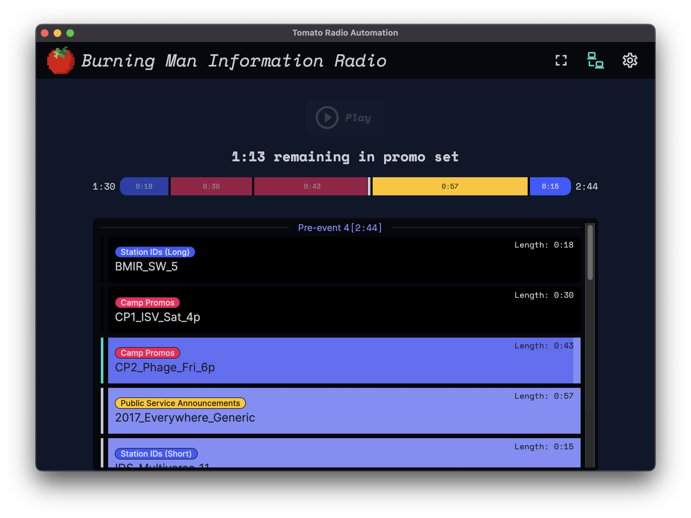

# The Tomato Desktop App

The desktop app is undocumented as it's being written and is in early preview
stages. You can, however download [preview builds](#preview-builds) or
[run the development code yourself](#run-development-code).

{ style="width: 100%" loading=lazy }


## Preview Builds

**Development preview builds may not be safe: use them at your own risk.**

Preview builds
[are available on GitHub](https://github.com/dtcooper/tomato/releases/tag/preview-build)
or can be download below.

  * [:material-download: macOS :simple-apple:](https://github.com/dtcooper/tomato/releases/download/preview-build/tomato-client-preview-macos.dmg)
    &mdash; An application bundle with a  **universal binary** for Intel or Apple M1 chips
  * [:material-download: Windows :simple-windows:](https://github.com/dtcooper/tomato/releases/download/preview-build/tomato-client-preview-windows.exe)
    &mdash; a Windows executable that automatically installs Tomato on first run (using
    [Squirrel.Windows](https://github.com/Squirrel/Squirrel.Windows))
  * Linux :simple-linux:
    * [:material-download: Ubuntu :simple-ubuntu: or Debian :simple-debian:](https://github.com/dtcooper/tomato/releases/download/preview-build/tomato-client-preview-linux_amd64.deb)
    &mdash; package in `.deb` format (amd64 only)
    * [:material-download: Arch :simple-archlinux: or Manjaro :simple-manjaro:](https://github.com/dtcooper/tomato/releases/download/preview-build/tomato-client-preview-linux-x86_64.pkg.tar.zst)
    &mdash; package in `.pkg.tar.zst` format (amd64 only)
    * [:material-download: Raspberry Pi :simple-raspberrypi:](https://github.com/dtcooper/tomato/releases/download/preview-build/tomato-client-preview-linux_arm64.deb)
    &mdash; arm64 `.deb` package suitable for Raspberry Pi

!!! danger "Unsigned Binaries"
    The above releases are **not signed** nor **notaraized**, which means
    you may have to go through your operating system's security settings to be
    able to run them. (This just means I didn't pay Apple :simple-apple: or
    Microsoft :simple-windows: an unnecessary fee to avoid these warnings.)

    Read more about [how to do that on macOS :simple-apple: here](https://support.apple.com/en-gb/HT202491)
    under the section _"If you want to open an app that hasn't been notarized or
    is from an unidentified developer."_

    On Windows :simple-windows: you may get a message along the lines of
    _**"Windows protected your PC"**_ in which you'll have to click _More Info >
    Run Anyway._

## Run Development Code

The development code runs on macOS :simple-apple: / Windows :simple-windows: / Linux :simple-linux:.

Prerequisites:

  * [Git](https://git-scm.com/)
    * On Windows, install [Git for Windows](https://gitforwindows.org/) and
      **make sure to use its included "Git Bash" terminal.**
  * [Node.js v18+](https://nodejs.org/)

To get the development code running, in your terminal run

```bash
# Clone the repo
git clone https://github.com/dtcooper/tomato.git

# Enter the client code
cd tomato/client

# Windows only: set npm's script shell to bash
[ "$(uname -o)" = "Msys" ] && npm config --location=project set script-shell $(which bash)

# Install dependencies and run
npm install
npm run dev
```
