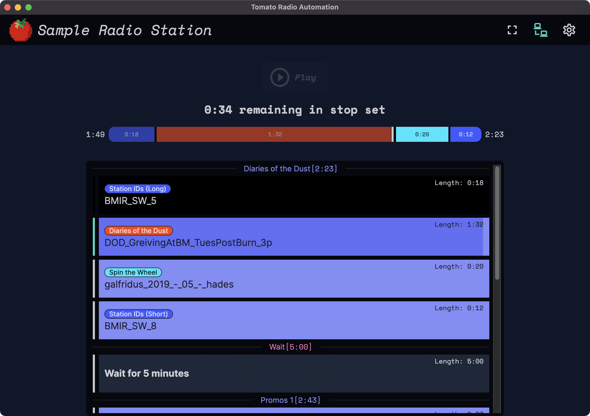
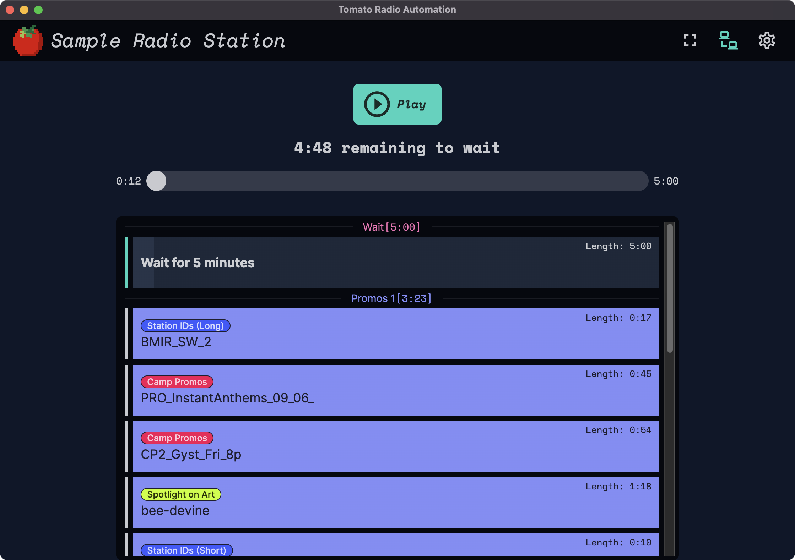
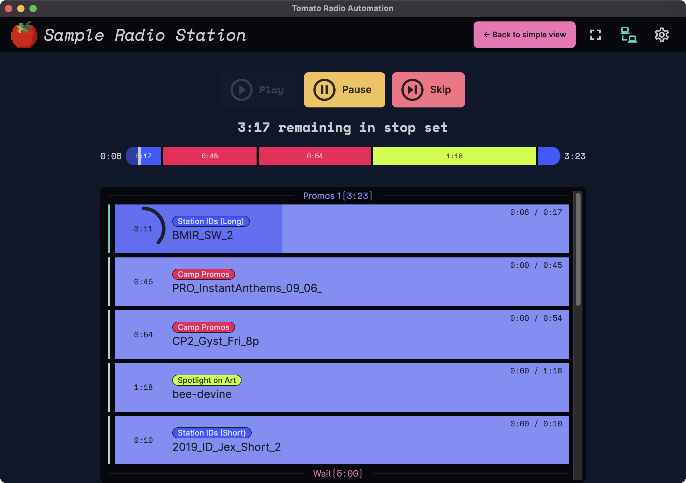
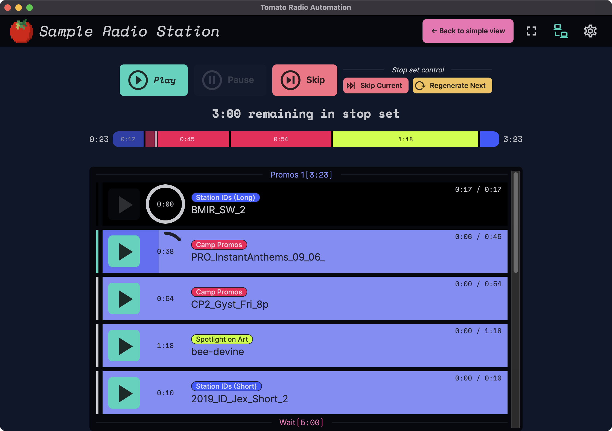

# The Tomato Desktop App

The desktop app is being developed and is in early preview stages. You can, however
download [preview builds](#preview-builds) or [run the development code yourself](#run-development-code).

{ style="width: 100%" loading=lazy }

## Features at a glance

### User Interface Modes

Tomato has three different user interface modes: **simple**, **standard**, and
**advanced** to accommodate varying levels of literacy with audio software.

Select a tab below to find out more about each mode.

To change this, head to the settings click on the settings gear :material-cog:
and choose a _"user interface mode"._

{ style="width: 400px" loading=lazy }

!!! info "User Interface Modes"

    === "Simple mode"

        The simplest mode Tomato can operate on. It has one _**Play**_ button
        that plays through a stop set.

        <figure markdown>
          { style="width: 100%" loading=lazy }
          <figcaption>Simple mode</figcaption>
        </figure>


        All other modes have a large button on the top that allow a confused user
        to return to this mode easily. It looks like this,

        { style="width: 200px" loading=lazy }

    === "Standard mode"

        Standard mode builds on simple mode adding radial countdown clocks on
        each item in the playlist, more details progress/duration information,
        and _**Pause**_ and _**Skip**_ buttons that work on the currently
        playing asset.

        <figure markdown>
          { style="width: 100%" loading=lazy }
          <figcaption>Standard mode</figcaption>
        </figure>

    === "Advanced mode"

        Advanced mode builds on simple mode adding stop set control, allowing you
        to skip the currently playing stop set and _regenerate the next_ stop set.

        This mode also adds individual play buttons next to all items in your
        playlist, for easy skipping ahead.

        <figure markdown>
          { style="width: 100%" loading=lazy }
          <figcaption>Advanced mode</figcaption>
        </figure>

## Preview Builds

**Development preview builds may not be safe: use them at your own risk.**

Preview builds
[are available on GitHub](https://github.com/dtcooper/tomato/releases/tag/preview-build)
or can be download below.

  * [:material-download: macOS :simple-apple:](https://github.com/dtcooper/tomato/releases/download/preview-build/tomato-client-preview-macos.dmg)
    &mdash; An application bundle with a  **universal binary** for Intel or Apple M1 chips

  * [:material-download: Windows :simple-windows:](https://github.com/dtcooper/tomato/releases/download/preview-build/tomato-client-preview-windows.exe)
    &mdash; a Windows executable that automatically installs Tomato on first run (using
    [Squirrel.Windows](https://github.com/Squirrel/Squirrel.Windows))

  * Linux :simple-linux: downloads:
      * Ubuntu :simple-ubuntu:, Debian :simple-debian: (and its derivatives), or Raspberry Pi :simple-raspberrypi:
          * `.deb` package: [:material-download: x86_64 (64-bit)](https://github.com/dtcooper/tomato/releases/download/preview-build/tomato-client-preview-linux_amd64.deb)
            or [:material-download: arm64 (Raspberry Pi)](https://github.com/dtcooper/tomato/releases/download/preview-build/tomato-client-preview-linux_arm64.deb)

      * Arch :simple-archlinux: or Manjaro :simple-manjaro:
          * `.pkg.tar.zst` package: [:material-download: x86_64 (64-bit)](https://github.com/dtcooper/tomato/releases/download/preview-build/tomato-client-preview-linux-x86_64.pkg.tar.zst)
            _only_

      * Universal [AppImage](https://appimage.org/) format
          * `.AppImage` file: [:material-download: x86_64 (64-bit)](https://github.com/dtcooper/tomato/releases/download/preview-build/tomato-client-preview-linux_amd64.AppImage)
            or [:material-download: arm64 (Raspberry Pi)](https://github.com/dtcooper/tomato/releases/download/preview-build/tomato-client-preview-linux_arm64.AppImage)

          * To run using an AppImage, do the following on whatever Linux :simple-linux: distribution
            you're using (using x86_64 as an example),

            ```bash
            wget https://github.com/dtcooper/tomato/releases/download/preview-build/tomato-client-preview-linux_amd64.AppImage
            chmod +x tomato-client-preview-linux_amd64.AppImage
            ./tomato-client-preview-linux_amd64.AppImage
            ```

!!! danger "Unsigned Binaries"
    The above releases are **not signed** nor **notaraized**, which means
    you may have to go through your operating system's security settings to be
    able to run them. (This just means I didn't pay Apple :simple-apple: or
    Microsoft :simple-windows: an unnecessary fee to avoid these warnings.)

    Read more about [how to do that on macOS :simple-apple: here](https://support.apple.com/en-gb/HT202491)
    under the section _"If you want to open an app that hasn't been notarized or
    is from an unidentified developer."_

    On Windows :simple-windows: you may get a message along the lines of
    _**"Windows protected your PC"**_ in which you'll have to click _More Info >
    Run Anyway._

## Run Development Code

The development code runs on macOS :simple-apple: / Windows :simple-windows: / Linux :simple-linux:.

Prerequisites:

  * [Git](https://git-scm.com/)
    * On Windows, install [Git for Windows](https://gitforwindows.org/) and
      **make sure to use its included "Git Bash" terminal.**
  * [Node.js v18+](https://nodejs.org/)

To get the development code running, in your terminal run

```bash
# Clone the repo
git clone https://github.com/dtcooper/tomato.git

# Enter the client code
cd tomato/client

# Windows only: set npm's script shell to bash
[ "$(uname -o)" = "Msys" ] && npm config --location=project set script-shell $(which bash)

# Install dependencies and run
npm install
npm run dev
```
