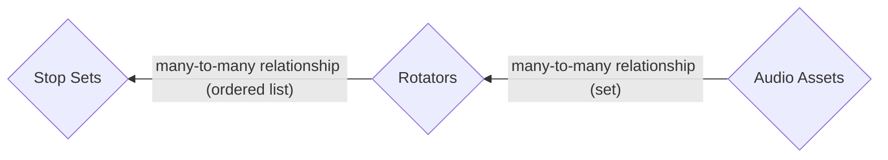

# Core Concepts, Explained

Below is a list of concepts and an explanation of how they're used in Tomato.

## Audio Entities

### Flow Diagram

While the definitions of what an [audio asset](#audio-asset), [rotator](#rotator),
and [stop set](#stop-set) are below, here's a simple flow diagram for them.



### Audio Asset
**An <u>audio asset</u> is a short individual audio track** (also referred to as just
an asset). Think individual advertisements, individual public service
announcements, or individual station IDs.

Assets always have a name and underlying audio file (like an mp3) but they can
have additional data for example when they begin and end airing.

!!! example "Audio Asset Example"
    A short advertisement audio clip named _"David's Steel Guitar Ad."_

### Rotator
**A <u>rotator</u> is a collection of audio assets.** A rotator is how you to
_categorize_ similar assets into a group.

While an asset _can_ belong to more than one rotator, in practice they won't.

!!! example "Rotator Example"
    From the asset example above, you might put _"David's Steel Guitar Ad"_
    along with other short ads for musical instruments in the _"Musical
    Instrument Ads"_ rotator.

### Stop Set
**A <u>stop set</u> is an ordered list of rotators.** A stop set can be thought
of as an entire commercial break, like what you'd hear in traditional radio. In
order to play a stop set, an asset is selected at random[^1] from each rotator
in it.

A rotator **can** be (and often is) in a stop set more than once. Think having
station ID jingles at the start and end of a stop set, as in the example below.

!!! example "Stop Set Example"
    If stop sets are a bit confusing to you, don't worry. Follow along.

    Let's say we have the following rotators created, and we've put assets in
    each of them them,

    ```mermaid
    flowchart TD
        sids(Station IDs\n<em>Rotator</em>)
        psas(Public Service Announcements\n<em>Rotator</em>)
        ads(Advertisements\n<em>Rotator</em>)
        sid1(S_ID_1.mp3\n<em>Asset</em>)
        sid2(S_ID_2.mp3\n<em>Asset</em>)
        sid3(S_ID_3.mp3\n<em>Asset</em>)
        sid1 --> sids
        sid2 --> sids
        sid3 --> sids
        psa1(PSA_1.mp3\n<em>Asset</em>)
        psa2(PSA_2.mp3\n<em>Asset</em>)
        psa1 --> psas
        psa2 --> psas
        ad1(AD_1.mp3\n<em>Asset</em>)
        ad2(AD_2.mp3\n<em>Asset</em>)
        ad3(AD_3.mp3\n<em>Asset</em>)
        ad1 --> ads
        ad2 --> ads
        ad3 --> ads
    ```

    Then we have an  _"Evening Stop Set",_ which contains this an ordered list
    of five rotators, shown here,

    ```mermaid
    flowchart RL
        stopset(Evening Stop Set)
        rotator1(1. Station IDs\n<em>Rotator</em>)
        rotator2(2. Advertisements\n<em>Rotator</em>)
        rotator3(3. Advertisements\n<em>Rotator</em>\n<strong><small>Repetition Allowed!</small></strong>)
        rotator4(4. Public Service Announcements\n<em>Rotator</em>)
        rotator5(5. Station IDs\n<em>Rotator</em>)
        rotator1 --- stopset
        rotator2 --- stopset
        rotator3 --- stopset
        rotator4 --- stopset
        rotator5 --- stopset
    ```

    Then, when an _"Evening Stop Set"_ is played by Tomato during a commercial
    break, here's what's played,

    ```mermaid
    flowchart LR
        stopset(Evening Stop Set)
        rotator1(1. Station IDs\n<em>Rotator</em>)
        rotator2(2. Advertisements\n<em>Rotator</em>)
        rotator3(3. Advertisements\n<em>Rotator</em>)
        rotator4(4. Public Service Announcements\n<em>Rotator</em>)
        rotator5(5. Station IDs\n<em>Rotator</em>)
        asset1(S_ID_2.mp3\n<em>Asset</em>)
        asset2(AD_3.mp3\n<em>Asset</em>)
        asset3(AD_1.mp3\n<em>Asset</em>)
        asset4(PSA_2.mp3\n<em>Asset</em>)
        asset5(S_ID_1.mp3\n<em>Asset</em>)
        rotator1 --- stopset
        rotator2 --- stopset
        rotator3 --- stopset
        rotator4 --- stopset
        rotator5 --- stopset
        asset1 -- randomly selected --- rotator1
        asset2 -- randomly selected --- rotator2
        asset3 -- randomly selected --- rotator3
        asset4 -- randomly selected --- rotator4
        asset5 -- randomly selected --- rotator5
    ```

## Wait Interval

## Random Weight
**A <u>random weight</u> is how likely random selection of an item occurs**,
when compared to all other items of the same type. The default weight of an item
with always $1$ unless modified.

Random weight is used when Tomato selects both assets and stop sets.

The likeliness (or "chance") of an item $x$ being selected is calculated as follows,

$$
x_{\text{chance}} = \frac{x_{\text{weight}}}{[\text{sum all of item weights}]}
$$

Expand the "Random Weight Example" below for an in-depth example and technical
explanation.

??? example "Random Weight Example"
    Let's dig a little deeper. For the purposes of this example, all assets are
    in a rotator called _"Commercials."_

    If an asset named _"Commercial A"_ has a weight of $2$ and all other assets
    have a weight of $1$, then asset _"Commercial A"_ is **twice as likely** to be
    selected when compared to all other assets.

    Suppose there are 26 commercials &mdash; one for each letter of the alphabet
    &mdash; and they're named _"Commercial A"_ through _"Commercial Z"_.

    We assign a weight of $2$ to _"Commercial A,"_ or $\text{A}_\text{weight}=2$
    and assign a weight of $1$ to _"Commercial B"_ through _"Commercial Z,"_
    or $\text{B}_\text{weight}=1,\ \text{C}_\text{weight}=1,\ \ldots,\ \text{X}_\text{weight}=1,\ \text{Z}_\text{weight}=1$.

    We get a sum of all random weights as $27$, illustrated below,

    $$
    \begin{align*}
    [\text{sum all of item weights}] &= \sum_{x=A}^{Z} x_\text{weight} \\
    &= \text{A}_\text{weight} + (\text{B}_\text{weight} + \text{C}_\text{weight}
        + \ldots + \text{X}_\text{weight} +  \text{Z}_\text{weight}) \\
    &= 2 + (1 + 1 + \ldots + 1 + 1) \\
    &= 2 + 25 \\
    &= 27
    \end{align*}
    $$

    Then, per the selection equation above,

    $$
    \begin{align*}
    \text{A}_\text{chance} &= \frac{\text{A}_\text{weight}}{\text{[sum all of item weights]}} \\
    &= \frac{2}{27} \\
    &\simeq 7.4\%
    \end{align*}
    $$

    So the chance we'll pick _"Commercial A_" with a random weight of $2$ is
    $\text{A}_\text{chance}=7.4\%$. Similarly,

    $$
    \begin{align*}
    \text{B}_\text{chance} &= \frac{\text{B}_\text{weight}}{\text{[sum all of item weights]}} \\
    &= \frac{1}{27} \\
    &\simeq 3.7\%
    \end{align*}
    $$

    The chance we'll pick _"Commercial B_" with a weight of $1$ is $\text{B}_\text{chance}=3.7\%$

    So as you can see, since $7.4\%$ is twice $3.7\%$, _"Commercial A"_ with
    weight $2$ is **twice as likely** to be played as _"Commercial B"_ with
    weight $1$.


[^1]: The random selection process can be biased by [random weight](#random-weight).
