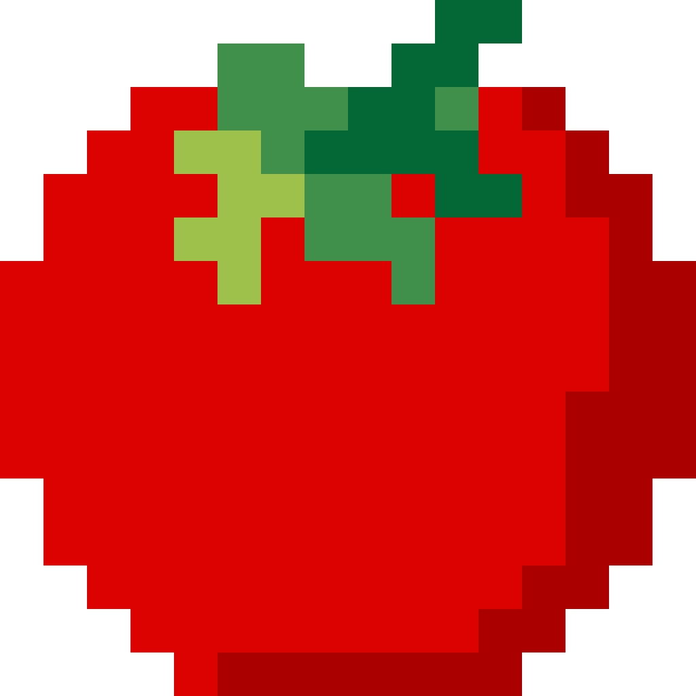
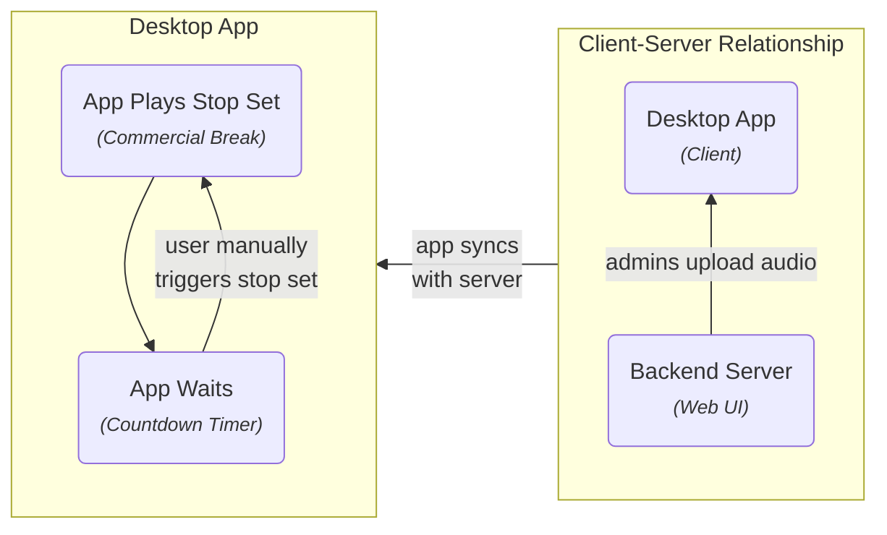
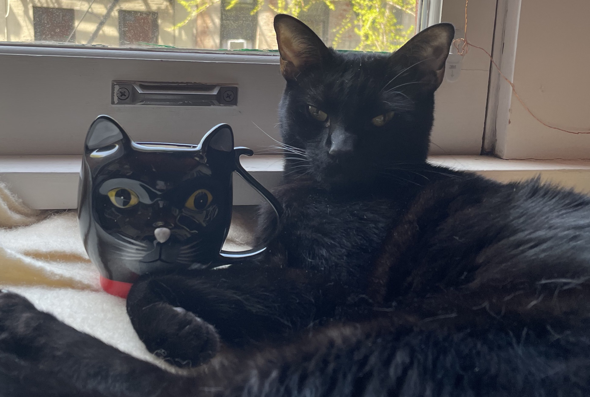

#  Welcome to Tomato 

Welcome to Tomato Radio Automation!

Tomato is easy to use, and hard to screw up playout software written for the
specific use case of [Burning Man Information Radio](https://bmir.org).

## Quickstart

You'll probably want to either read about the [desktop app](client.md) and
[backend server](server.md).

## Use Case

The use case of Tomato is extremely simple by design.

## Features

## Why The Name?

Simply said, this software was named after my cat, Tomato... or more
affectionately nicknamed Kitty, Tomatillo, The "Shink", Catly, Catniss Evercat,
Mr. Annoying, and Kitty Poopoo. His breed: _domestic street urchin._

<figure markdown>
{ style="max-width: 600px; width: 100%" loading=lazy }
<figcaption>Tomato with his favorite mug.</figcaption>
</figure>

## What's Next?

First, familiarize yourself with some [core concepts](concepts.md), then read
about how to use the [desktop app](client.md) and [backend server](server.md).
